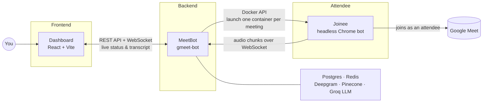

# Meeting Bot

live demo https://lnkd.in/p/gp8-Yv8E

Meeting Bot is an automated assistant that sits in on your Google Meet calls for you. It joins a meeting like a regular attendee, quietly listens to everything that's said, writes it all down (keeping track of who said what), and remembers it. Afterwards, instead of scrubbing through a recording or re-reading a wall of raw text, you can just ask it a plain-English question — "what did we decide about the launch date?" — and it will answer using only what was actually said in that meeting.

## Architecture



Three services work together: a frontend to start/watch/ask meetings, a backend that
turns audio into a searchable transcript, and a headless browser bot that actually
sits in the call.

## Components

### Dashboard (`dashboard/`)

A React + Vite single-page app. It lets you paste a Google Meet link to bring a
meeting under Memora's watch, shows each meeting's live status and transcript as it's
captured (over a WebSocket connection to the backend), and lets you ask plain-English
questions about a meeting — or across all of them — once there's something to search.

### MeetBot backend (`gmeet-bot/`)

The backend and brains of the operation. It exposes the HTTP API and WebSocket server
the dashboard and joinee both talk to, launches a joinee container per meeting via the
Docker API, streams that meeting's incoming audio into a real-time speech-to-text
session (labeling who said what as it goes), and saves the resulting transcript to
Postgres. Once a meeting ends, it groups the transcript into chunks, embeds and indexes
them in Pinecone, and answers later questions by retrieving the most relevant chunks
and handing them to an LLM with strict instructions to only answer from what's actually
in the transcript.

### Joinee (`joinee/`)

The attendee bot. It's a real, automated Chrome browser (via Playwright) that logs into
a saved Google session, navigates to the meeting URL, and clicks through whichever join
flow Google presents. Once inside, it doesn't touch the mic or camera — it captures
whatever audio the meeting tab is playing through a virtual audio device, streams it to
the backend in small chunks as the meeting happens, and watches the call for signs it
has ended so it can wrap up and shut itself down.

## Technical challenges

### Scaling live transcription

The joinee containers are completely stateless by design — they handle the browser
session and stream audio back to the API server over WebSocket. The API server
currently owns `TranscribeManager`, an in-memory map from meeting ID to that meeting's
live Deepgram connection.

That works fine at the current scale, but as the number of concurrent meetings grows,
the API server becomes responsible for an increasing number of long-lived connections
and in-memory state. Deepgram client objects can't simply be moved into Redis either —
they're live connections tied to a specific process, not serializable state.

The plan for scaling this is to separate the API server from the transcription
workers. The API server stays responsible for the application and durable state;
dedicated transcription workers own the live Deepgram connections instead. Redis acts
as the coordination layer — mapping a meeting to its assigned worker and tracking
worker health — while each worker keeps its own in-memory mapping of meeting IDs to
live Deepgram connections. That lets the transcription layer scale horizontally by
adding more workers, while the joinee containers stay exactly as stateless as they are
today.

### Reliable browser automation

Google Meet has a highly dynamic UI, so relying on explicit delays — "wait five
seconds, then click" — is easy to break: network conditions and meeting state vary, so
a fixed delay doesn't guarantee an element is actually ready.

Joinee instead uses Playwright's native waiting and locator utilities to wait for
specific UI conditions, such as an element becoming visible or actionable. Rather than
assuming a "Join now" button will appear after five seconds, it waits for the actual
button and fails early if neither "Join now" nor "Ask to join" appears within the
expected timeout. That makes the automation deterministic and resilient to timing
differences, instead of quietly racing the page.

## Local setup

The fastest way to get everything running is Docker Compose, from the repo root:

```
cp .env.example .env   # fill in DEEPGRAM_KEY, PINECONE_KEY, PINECONE_INDEX, GROQ_KEY
docker compose up
```

This starts Postgres, Redis, the `gmeet-bot` backend (`:3000`), and the dashboard
frontend (`:5173`). It also builds the `joinee` image and tags it `meet-joiner:latest`
so `gmeet-bot` can spin up a joinee container per meeting via the Docker socket — but
`joinee` itself isn't kept running by Compose, since it's meant to be launched on
demand, not as a standing service.

Building `joinee` requires `joinee/google_session.json` to already exist — run
`cd joinee && npm ci && npm run login` once, locally (outside Docker, interactively),
to create it before running `docker compose up`.

To run a service outside Docker instead — for tighter iteration during development —
see that service's own README: `dashboard/README.md`, `gmeet-bot/README.md`,
`joinee/README.md`.

## Future plans

- **Asynchronous transcription pipeline.** Chunking and indexing a meeting's
  transcript into Pinecone currently happens inline, synchronously, in the same
  handler that reacts to the meeting ending — so that request blocks on embedding and
  upserting every chunk before the meeting can be marked `COMPLETED`. A Redis-backed
  job queue (BullMQ) is already wired up for this; the plan is to enqueue that work
  instead of doing it inline, so meeting completion doesn't wait on it and it can be
  retried independently if it fails.
- **Isolated container runtime (e.g. ECS Fargate).** Joinee containers are currently
  launched by giving the backend direct access to the host's Docker socket
  ("Docker-outside-of-Docker") and running every meeting's bot as a sibling container
  on the same machine. That's fine for one host, but doesn't isolate meetings from each
  other well or scale past a single machine. The plan is to move joinee's container
  lifecycle onto a proper isolated runtime like ECS Fargate (one short-lived, fully
  sandboxed task per meeting) instead of talking to a local Docker daemon.

## Project layout

The repository is a small monorepo with three top-level services, each documented in
its own README:

- **`dashboard/`** — the frontend: start meetings, watch them live, ask questions. See `dashboard/README.md`.
- **`gmeet-bot/`** — the backend: speech-to-text, transcript storage, semantic search indexing, and the question-answering API. See `gmeet-bot/README.md`.
- **`joinee/`** — the browser-automation bot that joins the meeting, captures its audio, and streams that audio to the backend. See `joinee/README.md`.

Everything else at the root is repository-level plumbing:

- **`README.md`** — this file.
- **`docker-compose.yml`** / **`.env.example`** — brings up the whole stack for testing; see "Local setup" above.
- **`.gitignore`** — excludes dependencies (`node_modules`), build output (`dist`, `*.tsbuildinfo`), and sensitive local files (`.env`, `google_session.json`).
- **`.claude/`** — local configuration for the Claude Code assistant used to develop this repository; not part of the running application.
