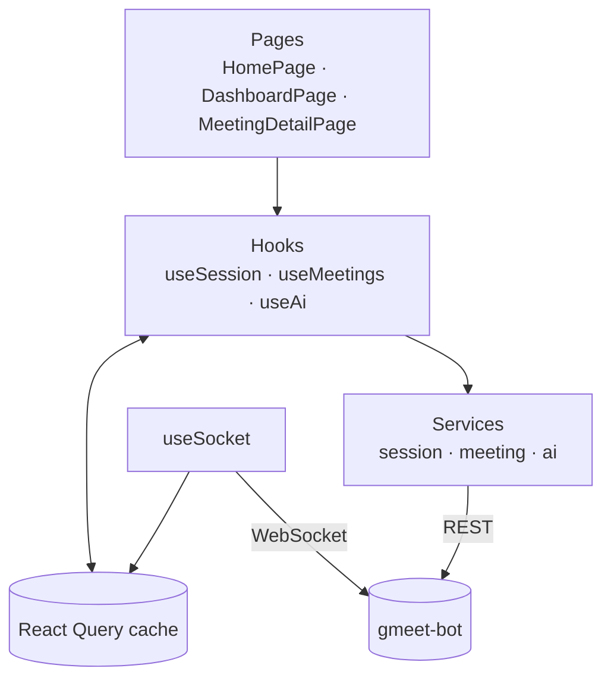

# Dashboard

The dashboard is Meeting Bot's frontend — a React + Vite single-page app, styled with
Tailwind, that talks to the `gmeet-bot` backend over REST and WebSocket. It's where you
paste in a Google Meet link, watch a meeting's status and transcript update live while
it's happening, and ask plain-English questions about it afterward.

## Architecture

Pages call hooks, hooks read and write a shared React Query cache and call services to
talk to the backend over REST. Separately, a single WebSocket connection (`useSocket`,
mounted once for the whole app) pushes live status and transcript updates straight into
that same cache, so any open page reflects them immediately without polling.

## Folder structure

### `src/pages/`

The route-level screens: `HomePage` (paste a meeting link in, bootstraps a session
behind the scenes), `DashboardPage` (list your meetings, bring a new one in, ask
questions across all of them), and `MeetingDetailPage` (one meeting's status timeline,
live transcript, and per-meeting Q&A). `pages/home/` holds the two pieces used only by
the home page — the URL input card and the hero illustration.

### `src/components/`

Presentational pieces, split by scope. `components/ui/` are generic primitives with no
app-specific knowledge (Button, Card, Input, Spinner, ConfirmationDialog, ...).
`components/dashboard/` are specific to the meetings-list screen (MeetingCard,
MeetingInput, the RagSearch/RagResult "ask across all meetings" widgets, empty/loading/
error states). `components/meeting/` are specific to a single meeting's detail screen
(StatusTimeline, TranscriptList/TranscriptItem, AskMeeting and its RagAnswer/SourceCard
pieces, MeetingSummary/SummarySection/ActionItem).

### `src/hooks/`

The React Query hooks pages call into: `useSession` bootstraps the session token,
`useMeetings` covers listing/creating/fetching/ending meetings and polling a meeting's
transcript while it's live, and `useAi` covers asking a question of one meeting or of
everything. `useSocket` is different in kind — it's mounted once in `App.tsx`, opens
the app's one WebSocket connection, and writes incoming live-transcript and
meeting-status messages directly into the React Query cache the other hooks read from.

### `src/services/` and `src/lib/`

`src/services/` is the thin HTTP layer — one `<resource>.service.ts` / `.types.ts` pair
per backend resource (`session`, `meeting`, `ai`), each just shaping a request body and
calling into the shared axios client. `src/lib/api.ts` is that shared client: it
lazily creates a session token on the first request that needs one and attaches it as a
bearer token to every request after. `src/lib/meetingDisplay.ts` turns raw backend
status codes and timestamps into the labels and lifecycle states the UI renders.
`src/lib/ws.ts` derives the WebSocket URL from the same `VITE_API_URL` the REST client
uses.

### `src/mock/`

Leftover from before the app was wired to real APIs. `meetingDetail.ts` is still in
active use — it holds shared display types (`SummaryData`, `MeetingLifecycleStatus`)
and the `formatElapsed` helper — but `meetings.ts` is no longer imported anywhere.

### App bootstrap

`src/main.tsx` sets up the TanStack Query provider and React Router. `src/App.tsx`
defines the three routes above and calls `useSocket()` once so the live connection
stays open regardless of which page is mounted.

### Root config

`package.json` defines the usual Vite scripts (`dev`, `build`, `lint`, `preview`).
`Dockerfile` / `.dockerignore` run the app via the Vite dev server for the root
Docker Compose setup (see the [root README](../README.md)) rather than a production
build. `.env` supplies `VITE_API_URL`, the only environment variable the app reads —
it must be reachable from the browser, not just from wherever the dev server runs.
