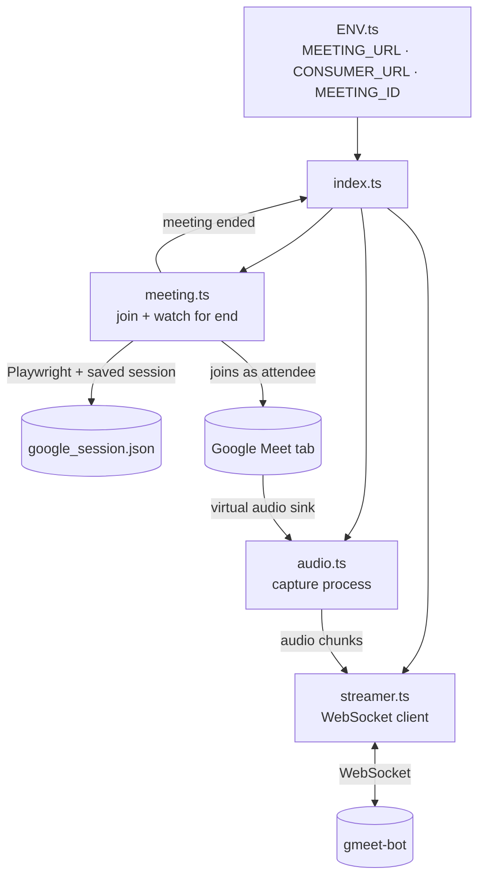

# Joinee

Joinee is the part of Meeting Bot that actually shows up to the call — a real,
automated Chrome browser that logs into Google, joins a Google Meet exactly like a
human attendee, and captures the meeting's audio as it plays. It doesn't transcribe or
remember anything itself; its only job is to join, capture, and stream that audio live
to the `gmeet-bot` backend, then notice when the meeting's over and shut itself down.

## Architecture

`index.ts` opens the WebSocket connection first, then hands off to `meeting.ts` to join
the call and to `audio.ts` to start capturing. Audio chunks flow straight to the
backend as they're produced; `meeting.ts` watches for the call ending — either told by
the backend or noticed on the page itself — and reports back to `index.ts` to wind
everything down.

## Folder structure

### `src/index.ts` — entry point

Reads its config from environment variables, opens the WebSocket connection to the
backend before doing anything else, joins the meeting, wires the captured audio stream
into outgoing messages, and coordinates shutdown — either on a signal from the backend
or by detecting locally that the meeting ended.

### `src/meeting.ts` — browser automation

Launches Chrome via Playwright with the saved Google session loaded, navigates to the
meeting link, dismisses the media-permission dialog, and clicks whichever join button
Google shows ("Join now" or "Ask to join"). Afterward it polls the page every few
seconds for signs the meeting has ended.

### `src/audio.ts` — audio capture

Spawns the process that reads from the container's virtual audio sink and turns
whatever the meeting tab is playing into a stream of raw, ready-to-send audio data.

### `src/streamer.ts` — backend connection

A small helper that opens the WebSocket connection to the backend's `CONSUMER_URL`.

### `src/save-session.ts` — one-time login

The standalone, interactive login script: opens a visible browser, waits for a human to
log into Google by hand, and writes the resulting session to `google_session.json`.
Run it via `npm run login` once (or whenever the saved session expires) before running
the bot for real.

### `src/ENV.ts` — configuration

Loads the three environment variables everything above depends on: `MEETING_URL`,
`CONSUMER_URL`, and `MEETING_ID`.

### `dockerfile`, `start.sh`, `scripts/start.sh` — container runtime

A two-stage Docker build: the first stage compiles the TypeScript source, the second
installs the system-level tools a headless meeting attendee needs — a virtual display
(Xvfb), the virtual audio system (PulseAudio) and its sink, and Chrome's native library
dependencies — before copying in the compiled app, the saved session, and a startup
script. `start.sh` at the project root is the one actually wired into the image: it
starts Xvfb and PulseAudio, creates the virtual sink, and only then launches the app.
`scripts/start.sh` is an earlier variant that sets up a differently-named sink and
isn't currently used by the image.

### `google_session.json`

The saved Google login session produced by `save-session.ts` and consumed by
`meeting.ts`. It's real login credentials in effect (cookies/local storage), so it's
gitignored — anyone running the bot has to generate their own locally.

### `package.json`

Scripts: `build` (compile), `start` (compile and run), `login` (compile and run the
session-saving script). Dependencies center on Playwright (browser automation) and
`ws` (the WebSocket client).

### `.env`

Local, untracked configuration matching what `ENV.ts` expects: the meeting URL, the
backend's address, and the meeting ID.
